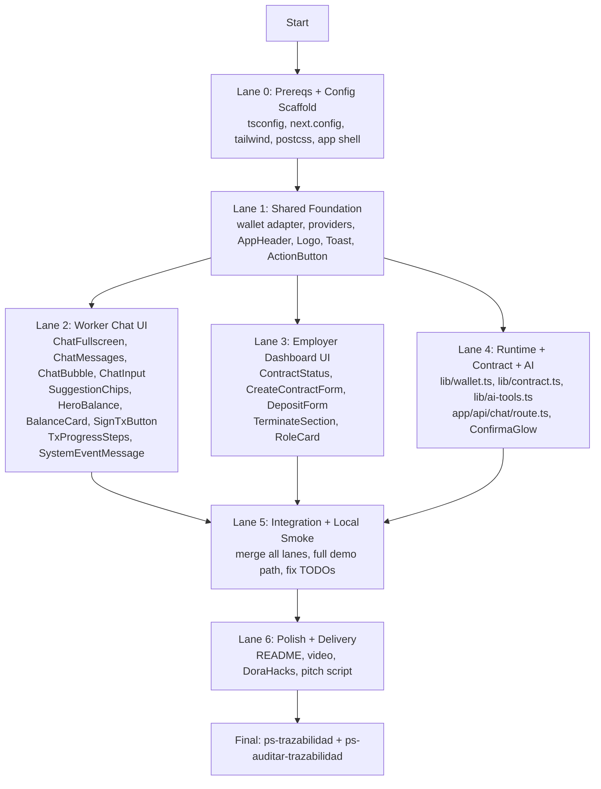

# Mega Plan: ContratoJusto - UI-RFC Full E2E Implementation

> Status: superseded by `.docs/planificacion/2026-03-26-remediacion-ui-rfc-live.md`.
> Use this file only as historical context for the first implementation wave. The active source of truth for remediation and live-tomorrow delta is the planification document above.

## Context

Historical snapshot before implementation wave 1: 41 documentation files, 13+ atomic UI-RFCs, 22 components defined, and a contract package ready to integrate. The current repo already contains a frontend scaffold and should no longer be treated as an empty frontend package.

**Target plan doc**: `.docs/plans/2026-03-26-ui-rfc-full-e2e.md`
**Deadline**: 27 marzo 17:00 | **Pitch**: 28 marzo
**Developer**: Gabriel (solo, fullstack architect)
**Priority**: Velocidad > Demo funcional > Completitud

## Repo State (verified)

| Layer | Files | Status |
|---|---|---|
| Contract (Soroban) | lib.rs (178 lines) + test.rs (234 lines, 7 tests) + Cargo.toml | ✅ Ready to compile+deploy |
| Frontend | App Router scaffold + providers + shared/chat/employer surfaces + API routes | In remediation |
| Wiki functional | 01-05 + 03_FL + FL/*.md (21 files) | ✅ Complete, 0 gaps |
| Wiki technical | 07-09 + TECH-FRONTEND (4 files) | ✅ Complete, SYSTEM_PROMPT defined |
| Wiki UX/UI | 10 (manifiesto, identidad, lineamientos, patrones 22 comps) + 11-14 (6 files) | ✅ Complete with visual decisions |
| UI-RFCs | 13+ atomic RFCs in 10_uxui/ (SHARED, WORKER, EMPLOYER) | ✅ Ready for implementar-ui-rfc |
| Plans | Historical plan; see `.docs/planificacion/2026-03-26-remediacion-ui-rfc-live.md` | Superseded |

## Closed Decisions

| Decision | Value |
|---|---|
| Wallet lib | @creit.tech/stellar-wallets-kit v1.9.5 (multi-wallet) |
| Stellar SDK | @stellar/stellar-sdk v13.3.0 |
| Framework | Next.js 15 (Vercel AI SDK requires it) |
| Animations | framer-motion v11 (7 animations: button scale, chat slideUp, balance countUp, page fade, tx check, skeleton shimmer, toast slideIn) |
| Signature moments | Number cascade (balance update) + Confirma-glow (tx success, opacity 0.05 green flash) |
| Empty state chat | AI welcome + 3 suggestion chips |
| Balance display | Hero number fijo arriba + BalanceCard inline en chat |
| Tx feedback | Multi-step inline con checkmarks progresivos (4 estados) |
| Referente visual | Wise base + toques Linear (gradiente header, blur leve) |
| claim_savings | Funciona SIEMPRE (antes y despues de terminacion) |
| prepararReclamo | Solo acepta tipo='ahorro' (indemnizacion auto en terminate) |
| SYSTEM_PROMPT | Canonico en TECH-FRONTEND (no emojis, no USDC, dolares, vos, calido-profesional) |
| Wallet adapter | lib/wallet.ts (consolida la integracion wallet canonica) |
| Runtime | Hybrid fixture→live |

## 22 Components (from patrones_ui)

| # | Component | Category |
|---|---|---|
| 1 | WalletConnect | shared |
| 2 | BalanceCard | shared |
| 3 | ChatBubble | chat |
| 4 | ChatInput | chat |
| 5 | SignTxButton | shared |
| 6 | DepositForm | employer |
| 7 | ContractStatus | employer |
| 8 | ActionButton | shared |
| 9 | RoleCard | home |
| 10 | CreateContractForm | employer |
| 11 | Toast | shared |
| 12 | AppHeader | shared |
| 13 | Logo | shared |
| 14 | ChatFullscreen | chat |
| 15 | ChatMessages | chat |
| 16 | TerminateSection | employer |
| 17 | LoadingIndicator | shared |
| 18 | SuggestionChips | chat |
| 19 | HeroBalance | chat |
| 20 | TxProgressSteps | chat |
| 21 | ConfirmaGlow | shared (layout) |
| 22 | SystemEventMessage | chat |

## Parallelization Map



## Lane 0: Prerequisites + Config Scaffold (30 min)

**Files to CREATE:**
```
packages/frontend/
├── tsconfig.json
├── next.config.ts
├── postcss.config.js
├── tailwind.config.ts
├── app/
│   ├── layout.tsx          ← root layout with providers + ConfirmaGlow
│   ├── page.tsx            ← Home (role selector)
│   └── globals.css         ← Tailwind imports + brand tokens
```

**Done when:** `pnpm dev` starts without errors, empty page renders.

## Lane 1: Shared Foundation (1h)

**Use:** `/implementar-ui-rfc` on UI-RFC-SHARED-APP-SHELL + UI-RFC-SHARED-ROLE-GATE

**Files to CREATE:**
```
packages/frontend/
├── providers/
│   ├── WalletProvider.tsx     ← StellarWalletsKit context
│   └── ContractProvider.tsx   ← Soroban read + auto-refresh
├── lib/
│   ├── wallet.ts              ← Kit adapter (openModal, sign, disconnect)
│   ├── runtime-config.ts      ← fixture vs live mode
│   ├── format.ts              ← truncateAddress, formatDolares
│   └── validation.ts          ← address validation, percentage sum
├── components/shared/
│   ├── AppHeader.tsx
│   ├── Logo.tsx
│   ├── WalletConnect.tsx
│   ├── ActionButton.tsx
│   ├── Toast.tsx
│   ├── LoadingIndicator.tsx
│   └── ConfirmaGlow.tsx
├── components/home/
│   └── RoleCard.tsx
```

**Done when:** Home renders with 2 RoleCards, wallet modal opens, address shows truncated.

## Lane 2: Worker Chat UI (1.5h)

**Use:** `/implementar-ui-rfc` on UI-RFC-WORKER-CHAT-SHELL + UI-RFC-WORKER-BALANCE-QUERY + UI-RFC-WORKER-CLAIM-SIGN + UI-RFC-WORKER-SYSTEM-EVENTS

**Files to CREATE:**
```
packages/frontend/
├── app/trabajador/
│   └── page.tsx
├── components/chat/
│   ├── ChatFullscreen.tsx
│   ├── ChatMessages.tsx
│   ├── ChatBubble.tsx
│   ├── ChatInput.tsx
│   ├── SuggestionChips.tsx
│   ├── HeroBalance.tsx
│   ├── SystemEventMessage.tsx
│   └── TxProgressSteps.tsx
├── components/shared/
│   ├── BalanceCard.tsx
│   └── SignTxButton.tsx
```

**Done when:** Chat renders with welcome + chips, AI responds, BalanceCard inline, SignTxButton with 4-step progress.

## Lane 3: Employer Dashboard UI (1h)

**Use:** `/implementar-ui-rfc` on UI-RFC-EMPLOYER-DASHBOARD-SHELL + UI-RFC-EMPLOYER-CREATE-CONTRACT + UI-RFC-EMPLOYER-DEPOSIT + UI-RFC-EMPLOYER-TERMINATE-CONTRACT

**Files to CREATE:**
```
packages/frontend/
├── app/empleador/
│   └── page.tsx
├── components/employer/
│   ├── ContractStatus.tsx
│   ├── CreateContractForm.tsx
│   ├── DepositForm.tsx
│   └── TerminateSection.tsx
```

**Done when:** Dashboard shows 3 states (no contract, active, terminated). Forms submit via wallet. Inline confirmation for terminate.

## Lane 4: Runtime + Contract + AI Wiring (1.5h)

**Files to CREATE:**
```
packages/frontend/
├── lib/
│   ├── contract.ts            ← Soroban facade (delegates to live/fixture)
│   ├── contract-live.ts       ← Real Soroban calls
│   ├── contract-fixture.ts    ← Mock data for local dev
│   ├── ai-tools.ts            ← 4 tools (consultarBalance, consultarEstado, prepararDeposito, prepararReclamo)
│   └── system-events.ts       ← Event types + helpers
├── app/api/
│   └── chat/
│       └── route.ts           ← Vercel AI SDK + micro-proxy + SYSTEM_PROMPT + tools
```

**Done when:** fixture mode drives full app. Live mode calls Soroban/Horizon/micro-proxy. AI responds with tools.

## Lane 5: Integration + Local Smoke (1h)

- Merge all lanes
- Resolve ALL TODO(human) placeholders
- Test full demo path: FL-01→FL-02→FL-03→FL-07→FL-04→FL-05
- Verify animations (framer-motion): button scale, chat slideUp, balance countUp, confirma-glow, number cascade
- Verify empty states, error states, calmo-seguro copy

**Done when:** Full demo path works locally in both fixture and live modes.

## Lane 6: Polish + Delivery (2h)

- README.md with demo instructions
- .env.example updated with real IDs post-deploy
- `cargo test` (7 tests pass)
- `pnpm --filter frontend build` succeeds
- Video demo (3 min)
- DoraHacks submission
- Pitch script (5 min)

**Done when:** Repo public on GitHub, video on DoraHacks, pitch ready.

## Final Lane: Traceability Closure

- Run ps-trazabilidad (verify RF/FL/arch/tests/tech sync)
- Run ps-auditar-trazabilidad (read-only audit)
- If gaps found → fix before calling done

## Verification Scenarios

### Happy path (demo)
1. Home: wallet modal opens, user selects Freighter, address appears
2. Empleador: creates contract 70/30, deposits 100 dolares
3. Trabajador: opens chat, sees welcome + chips, asks "cuanto tengo?"
4. AI responds with BalanceCard: 70 ahorro, 30 indemnizacion
5. Trabajador: "quiero mi ahorro" → AI prepares tx → 4-step progress → confirma-glow → balance updates
6. Empleador: terminates → inline confirmation → indemnizacion auto-released

### NUNCA validation
- No "USDC", "Soroban", "blockchain" in worker UI
- No modals (only inline confirmation)
- No lost visual trace after deposit/claim/terminate
- No role persistence outside session
- No claim_savings blocked post-termination

## Fase A: Cerrar 5 gaps pendientes (agentes en paralelo)

| # | Gap | Archivos | Fix |
|---|---|---|---|
| G1 | Props TS mismatch UI-RFCs vs patrones_ui | 10_patrones_ui.md, UI-RFC-CHAT.md, UI-RFC-DASHBOARD.md | Sync Props: onSuccess(txHash), signTransaction, severanceAmount |
| G2 | Dashboard UI-RFC falta accesibilidad | UI-RFC-DASHBOARD.md | Agregar seccion Accessibility Contract |
| G3 | CT-02 system prompt debe referenciar TECH-FRONTEND | 09_contratos_tecnicos.md | CT-02 apunta a TECH-FRONTEND como canonico |
| G4 | FL-02 no documenta is_terminated en precondiciones | FL-02-depositar-usdc.md | Agregar precondicion + error |
| G5 | RF-01-01 Input le falta employer param | 04_RF.md | Agregar employer como primer param |

## Fase B: Brainstorming profundo experiencia visual

### B1: Lineamientos de interfaz - preguntas pendientes
- Microinteracciones: que animaciones usa la app? (hover, click, transiciones de pagina)
- Feedback tactil: como se siente usar la app en un celular?
- Densidad de informacion: cuanta info se muestra de un vistazo vs progresiva?
- Modo error: como se ve un estado de error completo? (no solo el toast)
- Empty states: que ve el trabajador la primera vez antes de que haya depositos?
- Loading patterns: skeleton, spinner, o blur progresivo?
- Transiciones entre pantallas: slide, fade, instant?

### B2: Patrones UI - investigacion profunda
- Referentes visuales: que apps financieras LatAm son buenas? (Mercado Pago, Ualá, Lemon)
- Chat patterns: como WhatsApp, como Intercom, como ChatGPT?
- Balance display: numero grande centrado, card con grafico, lista de items?
- Boton de firma: como transmitir seguridad en el momento mas critico?
- Color psychology: el azul + esmeralda es suficiente o necesitamos mas contrast?
- Espaciado agresivo: mas whitespace = mas premium? o mas compacto = mas funcional?
- Dark mode: vale la pena para hackathon demo?

## Fase C: Crear mega plan de implementacion

Despues de cerrar gaps + refinar visual → lanzar /implementar-ui-rfc con:
- 3 UI-RFCs como input (HOME, CHAT, DASHBOARD)
- TECH-FRONTEND como guia arquitectural
- patrones_ui como design system
- 09_contratos como API reference

## Orden de ejecucion

1. **Fase A**: Fix 5 gaps (2 agentes, ~15 min)
2. **Fase B**: Brainstorming visual interactivo (preguntas 1 a 1)
3. **Fase B resultado**: Actualizar lineamientos + patrones_ui con decisiones
4. **Fase C**: /implementar-ui-rfc mega plan

## Que cambia (freighter-api → stellar-wallets-kit)

| Aspecto | Antes | Despues |
|---|---|---|
| Wallet lib | `@stellar/freighter-api` v2 | `@creit.tech/stellar-wallets-kit` v1.9.5 |
| Stellar SDK | `@stellar/stellar-sdk` v12 | `@stellar/stellar-sdk` v13.3.0 |
| Wallets | Solo Freighter | Freighter + Albedo + xBull + WalletConnect |
| Connect UX | Boton manual | Modal built-in (selector multi-wallet) |
| Sign API | `signTransaction(xdr, opts)` | `kit.signTransaction(xdr)` |
| Framework | Next.js 15 | Evaluar: Vite (workshop) o mantener Next.js (AI SDK) |
| Polyfills | No especificado | `vite-plugin-node-polyfills` (necesario para Stellar SDK) |

**Decision framework**: Mantener Next.js porque Vercel AI SDK (streamText, useChat, tool calling) solo funciona bien con Next.js route handlers. Vite no tiene equivalente para server-side AI streaming.

## Archivos a actualizar (19 docs + 2 codigo)

### Documentos funcionales/tecnicos
| Archivo | Cambio |
|---|---|
| `CLAUDE.md` | Reemplazar freighter-api → stellar-wallets-kit, SDK v12→v13, agregar Albedo/WalletConnect |
| `02_arquitectura.md` | Actualizar componente Wallet en tabla tech y diagrama |
| `07_baseline_tecnica.md` | Actualizar deps: stellar-wallets-kit, SDK v13, quitar freighter-api |
| `09_contratos_tecnicos.md` | Reescribir CT-04 (Freighter → Stellar Wallets Kit API) |
| `04_RF.md` | RF-05-01: "Conectar Freighter" → "Conectar Wallet (multi-wallet)" |
| `FL/FL-01 a FL-07` | Donde dice "Freighter" → "wallet del usuario (via Stellar Wallets Kit)" |

### Documentos UX/UI
| Archivo | Cambio |
|---|---|
| `10_patrones_ui.md` | WalletConnect component: usar kit.openModal() en vez de requestAccess() |
| `10_lineamientos_interfaz_visual.md` | Wallet section: modal built-in del kit |
| `14_UXS.md` | Spec Home: wallet connect usa modal del kit, no boton custom |
| `07_tech/TECH-FRONTEND-SYSTEM-DESIGN.md` | WalletProvider: StellarWalletsKit en vez de freighter-api, patrones del workshop |

### UI-RFCs (ya creados, actualizar)
| Archivo | Cambio |
|---|---|
| `10_uxui/UI-RFC-HOME.md` | WalletConnect usa kit.openModal(), interfaces updated |
| `10_uxui/UI-RFC-CHAT.md` | SignTxButton usa kit.signTransaction() |
| `10_uxui/UI-RFC-DASHBOARD.md` | Todas las firmas via kit.signTransaction() |

### Codigo
| Archivo | Cambio |
|---|---|
| `packages/frontend/package.json` | Reemplazar deps: quitar freighter-api, agregar stellar-wallets-kit, SDK v13 |
| `.env.example` | Sin cambios (SDK-agnostico) |

## Ejecucion

### Ronda 1: Actualizar codigo + docs tecnicos (agente 1)
- package.json: nuevas deps
- CLAUDE.md: stack actualizado
- 09_contratos CT-04: nueva API
- TECH-FRONTEND: WalletProvider con StellarWalletsKit
- 07_baseline: deps actualizadas

### Ronda 2: Actualizar docs funcionales + UX (agente 2)
- 02_arquitectura: diagrama + tabla
- 04_RF: RF-05-01 multi-wallet
- FL-01 a FL-07: "Freighter" → "wallet (kit)"
- 10_patrones_ui: WalletConnect component
- 14_UXS: Home wallet connect flow

### Ronda 3: Actualizar UI-RFCs (agente 3)
- UI-RFC-HOME: WalletConnect interfaces
- UI-RFC-CHAT: SignTxButton interfaces
- UI-RFC-DASHBOARD: sign interfaces

## Verificacion
- Grep "freighter-api" en todo el repo → 0 resultados (excepto referencias historicas)
- Grep "stellar-wallets-kit" en docs tecnicos → presente en CLAUDE.md, CT-04, TECH-FRONTEND, baseline
- package.json tiene @creit.tech/stellar-wallets-kit y @stellar/stellar-sdk v13
- WalletProvider usa StellarWalletsKit con FreighterModule + AlbedoModule

## Estado actual
- **Docs funcionales**: 01-05 + FL/*.md ✅
- **Docs tecnicos**: 07-09 + TECH-FRONTEND ✅
- **Docs UX/UI**: 10 (manifiesto, identidad, lineamientos, patrones) + 11-14 (UXR, UXI, UJ, UXS) ✅
- **Codigo**: lib.rs + test.rs + Cargo.toml + package.json ✅
- **Gap scan**: 11 agentes corriendo, esperando resultados

## Resultados gap-terminator (consolidando)

### Consolidado de 3 agentes completados (CLAUDE.md + Journey-Spec + Full scan)

**CRITICAL (3 gaps unicos - BLOQUEAN implementacion)**

| # | Issue | Files | Fix |
|---|---|---|---|
| C1 | FL-06 documenta `claim_severance()` que NO existe en lib.rs. terminate() auto-libera. | FL-06, RF-03-02, CT-01, FL-07 | ELIMINAR FL-06 o marcar como historico. Actualizar 03_FL.md. |
| C2 | `prepararReclamo(tipo: 'ahorro'\|'indemnizacion')` pero solo 'ahorro' es valido | CLAUDE.md:134, RF-04-03:110, FL-07:93 | Cambiar a `tipo: 'ahorro'` everywhere |
| C3 | FL-06 se autocontradice: "requiere implementar" + "ya existe en lib.rs" | FL-06:74 | Fix con C1 |

**HIGH (12 gaps unicos)**

| # | Issue | Files | Fix |
|---|---|---|---|
| H1 | Demo AI dice "USDC" pero manifiesto dice "dolares" | CLAUDE.md:164,171,187 | Replace USDC→dolares |
| H2 | 14_UXS falta spec Freighter confirmation + post-tx states | 14_UXS | Agregar estados loading/success/error |
| H3 | 14_UXS falta specs de notificaciones (deposito, terminacion) | 14_UXS, 13_UJ | Agregar seccion notificaciones |
| H4 | "Calmo-seguro" no aplicado en momentos de alta friccion | 12_UXI, 14_UXS | Agregar copy tranquilizador en errors |
| H5 | Copy inconsistente entre 12_UXI y 14_UXS (2 casos missing) | 12_UXI, 14_UXS | Sync copy deposito + terminacion worker |
| H6 | Color indemnizacion: UXI dice gris, UXS dice azul | 12_UXI, 14_UXS | Unificar a gris (UXI tiene razon) |
| H7 | TECH-FRONTEND falta system prompt location + error handling | TECH-FRONTEND | Agregar secciones |
| H8 | 10_patrones_ui faltan estados (loading, error) en componentes | 10_patrones_ui | Agregar estados |
| H9 | SignTxButton behavior no alineado con FL-07 detalle | 14_UXS, FL-07 | Agregar disabled/error states |
| H10 | Deps faltantes en 07_baseline: @ai-sdk/openai-compatible, lucide-react | 07_baseline | Agregar |
| H11 | RF-03-02 contradice FL-06 (auto vs manual) | 04_RF, FL-06 | Fix con C1 |
| H12 | Dashboard empleador falta estado "creando contrato" (in-flight) | 14_UXS | Agregar |

**MEDIUM (8 gaps unicos mas relevantes)**

| # | Issue | Fix |
|---|---|---|
| M1 | Campo fantasma "creation_date" en CLAUDE.md | Remover |
| M2 | Test coverage: faltan tests de error (amount=0, non-worker claim) | Agregar tests |
| M3 | Latencia AI: UXI dice <2s, UXS dice <3s | Unificar: <2s cached, <3s LLM |
| M4 | Journey emotions no mapean 100% a UXI sensations | Agregar sensaciones faltantes |
| M5 | 05_modelo y 08_modelo son redundantes | Agregar cross-ref |
| M6 | No hay catalogo de errores unificado | Crear ERROR_CATALOG o agregar a RF |
| M7 | 03_FL.md no tiene columna RF en inventario | Agregar |
| M8 | AF-06 status ambiguo (DEFERRED pero "verificable via Horizon") | Clarificar |

### Agentes completados: 4 de 11 (AI tools, Full scan, CLAUDE.md, Journey-Spec)
### Agentes pendientes: 7 (confirman los mismos gaps, no bloquean)

---

## Plan de fixes (CRITICAL + HIGH priorizados)

### FIX-1: Eliminar FL-06 como flujo activo [CRITICAL]
**Archivos**: FL-06, 03_FL.md, 02_arquitectura.md §7
- FL-06: Agregar nota "HISTORICO - no implementar. terminate() auto-libera." al inicio
- 03_FL.md: Cambiar prioridad FL-06 a "N/A (incluido en FL-05)"
- 02_arquitectura.md §7: Actualizar FL-06 nota

### FIX-2: prepararReclamo solo acepta 'ahorro' [CRITICAL]
**Archivos**: CLAUDE.md:134, RF-04-03:110, FL-07:93, 09_contratos CT-02
- Cambiar `tipo: 'ahorro'|'indemnizacion'` → `tipo: 'ahorro'`
- Agregar nota: "Indemnizacion auto-liberada en terminate()"

### FIX-3: USDC → dolares en dialogo AI [HIGH]
**Archivos**: CLAUDE.md:164,171,187
- Replace "USDC" → "dolares" en todos los ejemplos de dialogo AI

### FIX-4: Remover creation_date fantasma [MEDIUM]
**Archivos**: CLAUDE.md:126
- Remover "creation_date" de consultarEstado return

### FIX-5: Sistema prompt canonico [HIGH]
**Archivos**: 09_contratos CT-02, FL-03, TECH-FRONTEND
- Unificar system prompt con reglas de 10_manifiesto (no emojis, no blockchain jargon, "dolares" no "USDC", tono calido-profesional)

### FIX-6: Color indemnizacion UXI vs UXS [HIGH]
**Archivos**: 14_UXS
- Cambiar color indemnizacion de azul (#1e40af) a gris (#9ca3af) per UXI

### FIX-7: Agregar estados in-flight a UXS [HIGH]
**Archivos**: 14_UXS
- Agregar estados: "Creando contrato...", "Depositando...", "Firmando...", "Procesando..."
- Agregar notificaciones: deposito recibido, contrato terminado

### FIX-8: Latencia AI unificada [MEDIUM]
**Archivos**: 12_UXI, 14_UXS
- Unificar: <2s cached balance, <3s LLM calls

### FIX-9: Deps faltantes en baseline [HIGH]
**Archivos**: 07_baseline_tecnica.md
- Agregar: @ai-sdk/openai-compatible, lucide-react, tailwindcss version exacta

### FIX-10: Tests de error faltantes [MEDIUM]
**Archivos**: packages/contract/src/test.rs
- Agregar: test_deposit_zero, test_non_worker_claim, test_already_terminated

### FIX-11: Line ref CLAUDE.md [LOW]
**Archivos**: CLAUDE.md:107
- Cambiar ~117 → ~126-148

## Verificacion post-fix
- Re-run gap-terminator en CLAUDE.md, FL-06, RF-04-03, 09_contratos
- Verificar cadena UX: manifiesto → identidad → lineamientos → patrones → TECH
- cargo test (incluyendo nuevos tests de error)

## ps-asistente-wiki: Fases UX/UI pendientes de brainstorming

Segun el workflow canonico (Route B: scope-first), despues de Gate 3 vienen:

### Gate 4: Experience philosophy
- **Skill**: crear-manifiesto-experiencia
- **Produce**: `10_manifiesto_marca_experiencia.md`
- **Que define**: Filosofia UX global, personalidad de marca, objetivo emocional
- **Brainstorming pendiente**: Que sensacion debe transmitir ContratoJusto? Seguridad? Simplicidad? Empoderamiento?

### Gate 5: Global visual base
- **Skills**: crear-identidad-visual, crear-lineamientos-interfaz
- **Produce**: `10_identidad_visual.md`, `10_lineamientos_interfaz_visual.md`
- **Que define**: Colores, tipografia, logo, reglas de interfaz
- **Brainstorming pendiente**: Que look tiene ContratoJusto? Fintech moderno? Social/comunitario? Minimalista?

### Gate 6: Case UX
- **Skills**: crear-ux-research, crear-intencion-ux, crear-journey-ux, crear-spec-ux
- **Produce**: `11_UXR.md`, `12_UXI.md`, `13_UJ.md`, `14_UXS.md`
- **Que define**: Research, intencion emocional por caso, journeys, specs de pantallas criticas
- **Brainstorming pendiente**: Que siente el trabajador al reclamar? El empleador al depositar?

### Gate 7: UI patterns + frontend system design
- **Skills**: crear-patrones-ui, crear-system-design-frontend
- **Produce**: `10_patrones_ui.md`, `07_tech/TECH-FRONTEND-SYSTEM-DESIGN.md`
- **Que define**: Componentes reutilizables, tokens de diseno, reglas de implementacion

## Decision: Crear TODOS completos

Gabriel quiere el pipeline UX/UI completo. Ejecutar con brainstorming agrupado.

### Orden de ejecucion (secuencial por dependencia)

**Ronda 1 - Brainstorming UX/UI agrupado**
Un solo brainstorming que cubra: personalidad de marca, objetivo emocional, tono AI, colores, tipografia, target user, journeys criticos, sensaciones por paso.

**Ronda 2 - Crear docs Gate 4 (dependencia: brainstorming)**
- `10_manifiesto_marca_experiencia.md` via crear-manifiesto-experiencia

**Ronda 3 - Crear docs Gate 5 (dependencia: manifiesto)**
- `10_identidad_visual.md` via crear-identidad-visual
- `10_lineamientos_interfaz_visual.md` via crear-lineamientos-interfaz

**Ronda 4 - Crear docs Gate 6 (dependencia: identidad + lineamientos)**
- `11_UXR.md` via crear-ux-research
- `12_UXI.md` via crear-intencion-ux
- `13_UJ.md` via crear-journey-ux
- `14_UXS.md` via crear-spec-ux

**Ronda 5 - Crear docs Gate 7 (dependencia: specs + patrones)**
- `10_patrones_ui.md` via crear-patrones-ui
- `07_tech/TECH-FRONTEND-SYSTEM-DESIGN.md` via crear-system-design-frontend

### Archivos a crear (9 docs nuevos)

| Archivo | Gate | Skill |
|---|---|---|
| `10_manifiesto_marca_experiencia.md` | 4 | crear-manifiesto-experiencia |
| `10_identidad_visual.md` | 5 | crear-identidad-visual |
| `10_lineamientos_interfaz_visual.md` | 5 | crear-lineamientos-interfaz |
| `11_UXR.md` | 6 | crear-ux-research |
| `12_UXI.md` | 6 | crear-intencion-ux |
| `13_UJ.md` | 6 | crear-journey-ux |
| `14_UXS.md` | 6 | crear-spec-ux |
| `10_patrones_ui.md` | 7 | crear-patrones-ui |
| `07_tech/TECH-FRONTEND-SYSTEM-DESIGN.md` | 7 | crear-system-design-frontend |

### Verificacion
- Cada doc sigue la estructura de su skill
- Trazabilidad: manifiesto → identidad → lineamientos → journeys → specs → patrones
- Todos los docs son consistentes con la narrativa anti-inflacion + blockchain invisible

**Quien**: Gabriel (solo, arquitecto fullstack)
**Deadline**: 27 marzo 17:00 (entrega DoraHacks)
**Pitches**: 28 marzo (finalistas, 5 min + 2 min Q&A)
**Priority**: Velocidad > Demo funcional > Completitud

### Documentacion lista (referencia)
| Doc | Para que sirve manana |
|---|---|
| `CLAUDE.md` | Claude Code lee esto automaticamente |
| `09_contratos_tecnicos.md` | **API reference**: firmas Soroban, AI tools TypeScript, Freighter, Horizon |
| `04_RF.md` | **Criterios de aceptacion** para cada feature |
| `03_FL.md` + `FL/*.md` | **Pasos exactos** de cada flujo |
| `packages/contract/src/lib.rs` | **Contrato Soroban ya escrito** (~150 lineas) |
| `packages/contract/src/test.rs` | **Tests ya escritos** (3 tests) |

---

## Batch 1: Setup + Soroban (07:00-10:30) - 3.5h

### 1a. Setup entorno (07:00-07:45)
```
Archivos: ninguno nuevo, solo instalacion
```
- [ ] Instalar Rust: `curl --proto '=https' --tlsv1.2 -sSf https://sh.rustup.rs | sh`
- [ ] Target WASM: `rustup target add wasm32-unknown-unknown`
- [ ] Stellar CLI: `cargo install stellar-cli --locked`
- [ ] Configurar testnet: `stellar network add testnet --rpc-url https://soroban-testnet.stellar.org --network-passphrase "Test SDF Network ; September 2015"`
- [ ] Crear 2 identidades: `stellar keys generate employer --network testnet` + `stellar keys generate worker --network testnet`
- [ ] Fondear ambas: `stellar keys fund employer --network testnet` + idem worker
- [ ] Instalar Freighter Chrome extension + cambiar a testnet
- [ ] Verificar micro-proxy: `curl https://proxy.gestionturismo.xyz/health`

**Checkpoint 07:45**: `stellar version` OK, 2 identidades fondeadas, Freighter en testnet

### 1b. Compilar + testear contrato (07:45-08:30)
```
Archivos: packages/contract/src/lib.rs (ya existe), packages/contract/src/test.rs (ya existe)
```
- [ ] `cd packages/contract && cargo test` - los 3 tests deben pasar
- [ ] `stellar contract build` - compilar a WASM
- [ ] Verificar: `target/wasm32-unknown-unknown/release/contrato_justo.wasm` existe
- [ ] Fix cualquier error de compilacion (referencia: 09_contratos_tecnicos.md CT-01)

**Checkpoint 08:30**: `cargo test` pasa, WASM compilado

### 1c. Deploy a testnet + verificar (08:30-09:30)
```
Archivos: .env (crear con CONTRACT_ID despues del deploy)
```
- [ ] Deploy: `stellar contract deploy --wasm target/wasm32-unknown-unknown/release/contrato_justo.wasm --network testnet --source employer`
- [ ] Guardar CONTRACT_ID retornado
- [ ] Setup USDC trustline para employer y worker (ver Setup_Dev.md)
- [ ] Invoke initialize: `stellar contract invoke --id {CONTRACT_ID} --network testnet --source employer -- initialize --employer {EMPLOYER_ADDR} --worker {WORKER_ADDR} --token {USDC_TOKEN} --savings_pct 70 --severance_pct 30`
- [ ] Invoke get_balance para verificar: debe retornar (0, 0, 0, 0)
- [ ] Invoke deposit con 100 USDC de prueba
- [ ] Invoke get_balance: debe retornar (70, 30, 100, 1)
- [ ] Verificar en stellar.expert o Stellar Laboratory

**Checkpoint 09:30**: Contrato deployado, deposit + get_balance funcionan via CLI

### 1d. Fallback check (09:30-10:00)
- Si Soroban funciona: continuar a Batch 2
- Si Soroban falla: implementar Claimable Balances (1h, ver 02_arquitectura.md §Fallback)

**GATE 10:00**: Soroban funciona → GO. No funciona → FALLBACK 1h, luego Batch 2 a las 11:00.

---

## Batch 2: Frontend + AI Chat (10:00-14:00) - 4h

### 2a. Next.js scaffold + Wallets Kit connect (10:00-11:00)
```
Archivos a crear:
  packages/frontend/app/layout.tsx
  packages/frontend/app/page.tsx
  packages/frontend/app/empleador/page.tsx
  packages/frontend/app/trabajador/page.tsx
  packages/frontend/lib/stellar.ts         -- Stellar SDK wrapper
  packages/frontend/lib/wallet.ts          -- Wallets Kit connect/sign facade
  packages/frontend/components/WalletConnect.tsx
```
- [ ] `cd packages/frontend && pnpm install`
- [ ] `pnpm dev` - verificar que levanta
- [ ] Implementar `lib/wallet.ts`: connect(), getNetwork(), signTransaction() via Stellar Wallets Kit (ref: 09_contratos CT-04)
- [ ] Implementar `components/WalletConnect.tsx`: boton connect, muestra public key
- [ ] Implementar `lib/stellar.ts`: SorobanClient, server connection, contract instance
- [ ] Layout: header con WalletConnect, nav empleador/trabajador
- [ ] Pagina home: landing simple con 2 botones (Soy Empleador / Soy Trabajador)

**Checkpoint 11:00**: Frontend levanta, Wallets Kit conecta, muestra public key (RF-05-01)

### 2b. Paginas empleador: crear + depositar (11:00-12:00)
```
Archivos a crear:
  packages/frontend/lib/contract.ts        -- Soroban invoke helpers
  packages/frontend/components/CreateContract.tsx
  packages/frontend/components/DepositForm.tsx
  packages/frontend/components/ContractStatus.tsx
```
- [ ] `lib/contract.ts`: funciones para construir txs Soroban (initialize, deposit, terminate, claim_savings, get_balance, get_info) - referencia: 09_contratos CT-01
- [ ] `CreateContract.tsx`: form (worker address, savings_pct, severance_pct) → invoke initialize → wallet sign (FL-01)
- [ ] `DepositForm.tsx`: form (amount USDC) → invoke deposit → wallet sign (FL-02)
- [ ] `ContractStatus.tsx`: lee get_info() + get_balance(), muestra pools y estado
- [ ] `/empleador/page.tsx`: renderiza CreateContract + DepositForm + ContractStatus + boton Terminar

**Checkpoint 12:00**: Empleador puede crear contrato y depositar USDC via wallet (RF-01-01, RF-02-01)

### 2c. AI Chat Level 3 (12:00-13:30)
```
Archivos a crear:
  packages/frontend/app/api/chat/route.ts  -- Vercel AI SDK route handler
  packages/frontend/lib/ai-tools.ts        -- Tool definitions
  packages/frontend/components/Chat.tsx     -- Chat UI component
```
- [ ] `lib/ai-tools.ts`: 4 tools (consultarBalance, consultarEstado, prepararDeposito, prepararReclamo) - referencia: 09_contratos CT-02
- [ ] `app/api/chat/route.ts`: Vercel AI SDK streamText() con micro-proxy como provider + tools + system prompt en castellano (ref: CT-03)
- [ ] `components/Chat.tsx`: chat UI con useChat() de Vercel AI SDK, muestra mensajes + boton "Firmar" cuando AI retorna XDR
- [ ] System prompt: "Sos un asesor financiero para trabajadores informales argentinos. Hablas en castellano simple, sin jerga tecnica..."
- [ ] Testear: "cuanto tengo?" → AI llama consultarBalance → responde con datos reales
- [ ] Testear: "quiero reclamar mi ahorro" → AI llama prepararReclamo → muestra XDR + boton firmar

**Checkpoint 13:30**: AI chat responde con datos on-chain y puede preparar transacciones (RF-04-01, RF-04-03)

### 2d. Pagina trabajador + integracion (13:30-14:00)
```
Archivos a modificar:
  packages/frontend/app/trabajador/page.tsx
```
- [ ] `/trabajador/page.tsx`: ContractStatus (balance) + Chat (AI) + boton Reclamar Ahorro manual
- [ ] Flujo firma desde chat: cuando AI retorna XDR, boton "Firmar" llama `lib/wallet.ts` (FL-07 completo)
- [ ] Boton "Terminar contrato" en pagina empleador (FL-05)
- [ ] Test demo path completo (5 pasos del pitch)

**Checkpoint 14:00**: Demo path funciona end-to-end

---

## Batch 3: Polish + Entrega (14:00-17:00) - 3h

### 3a. Fix bugs del happy path (14:00-15:00)
- [ ] Probar con 2 wallets diferentes (employer y worker)
- [ ] Verificar cada paso del demo path (FL-01 → FL-02 → FL-03 → FL-07 → FL-05)
- [ ] Fix errores de UX (loading states, error messages en castellano)
- [ ] Si sobra tiempo: agregar boton "Terminar" con confirmacion

### 3b. README + entregables (15:00-16:00)
```
Archivos a crear:
  README.md
  .env.example (actualizar con CONTRACT_ID real)
```
- [ ] README.md: que es, problema que resuelve, como correr, screenshots/demo, stack, roadmap
- [ ] .env.example actualizado con CONTRACT_ID del deploy real
- [ ] Limpiar secrets del repo (verificar .gitignore)
- [ ] Push a GitHub (repo publico)

### 3c. Demo video + DoraHacks (16:00-16:45)
- [ ] Grabar screen recording del demo path (3 min max)
- [ ] Subir video a DoraHacks
- [ ] Completar formulario DoraHacks (descripcion, team, links)
- [ ] Registrar en formulario Google paralelo

### 3d. Pitch prep (16:45-17:00)
- [ ] Script de pitch (5 min):
  1. Problema: 46% informalidad + 200% inflacion (30 seg)
  2. Solucion: ContratoJusto en Stellar (30 seg)
  3. Demo en vivo: crear → depositar → AI chat → reclamar (2 min)
  4. Innovacion: AI que prepara transacciones, blockchain invisible (30 seg)
  5. Roadmap: Trustless Work, Lendara, Blend, Telegram bot (30 seg)
  6. Call to action (30 seg)

**ENTREGA 17:00**: Repo publico, video, DoraHacks submission

---

## Archivos criticos del proyecto (estado actual)

| Archivo | Estado | Accion manana |
|---|---|---|
| `packages/contract/src/lib.rs` | ✅ Escrito (150 lineas) | Compilar + deploy |
| `packages/contract/src/test.rs` | ✅ Escrito (3 tests) | Ejecutar |
| `packages/contract/Cargo.toml` | ✅ Configurado | - |
| `packages/frontend/package.json` | ✅ Deps definidas | `pnpm install` |
| `packages/frontend/app/` | ✅ Existe | Remediar y alinear con UI-RFC |
| `packages/frontend/lib/stellar.ts` | ❌ | **CREAR**: Stellar SDK wrapper |
| `packages/frontend/lib/wallet.ts` | ✅ Existe | Remediar y consolidar Wallets Kit |
| `packages/frontend/lib/contract.ts` | ❌ | **CREAR**: Soroban invoke helpers |
| `packages/frontend/lib/ai-tools.ts` | ❌ | **CREAR**: 4 AI tool definitions |
| `packages/frontend/app/api/chat/route.ts` | ❌ | **CREAR**: AI chat backend |
| `packages/frontend/components/*.tsx` | ❌ | **CREAR**: UI components |
| `README.md` | ❌ | **CREAR** (Batch 3) |
| `.env` | ❌ | **CREAR** post-deploy con CONTRACT_ID |

## Verificacion end-to-end

1. `cargo test` pasa (3 tests)
2. Contrato deployado en testnet, `stellar contract invoke get_balance` retorna datos
3. Frontend levanta con `pnpm dev`, la wallet se conecta
4. Empleador crea contrato y deposita USDC via wallet
5. Trabajador pregunta "cuanto tengo?" → AI responde con datos reales
6. Trabajador dice "quiero mi ahorro" → AI prepara tx → la wallet firma → USDC llega
7. Empleador termina contrato → indemnizacion auto-liberada al worker
8. Video de 3 min captura el demo path
9. Subido a DoraHacks antes de 17:00
