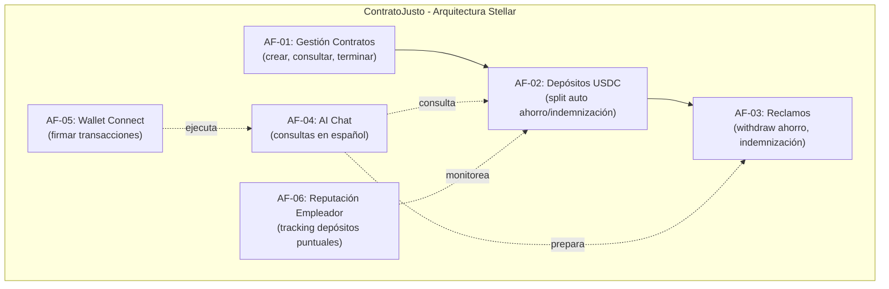

# 01 - Alcance Funcional: ContratoJusto

> Derechos laborales digitales para trabajadores informales en Argentina, sobre Stellar blockchain

---

## 1. Objetivo del producto

Proveer a trabajadores informales en Argentina (46%+ de la PEA) un contrato laboral digital auto-ejecutable en Stellar (Soroban) que acumule ahorros en USDC (dólares digitales) contra la inflación argentina, separando automáticamente fondos de ahorro e indemnización, sin intermediarios ni dependencia estatal.

**Exito se mide por**: un MVP funcional en Stellar testnet que demuestre el flujo completo (crear contrato, depositar USDC, split automático, reclamos) operando via AI chat conversacional en español, presentable como demo/pitch en Vendimia Tech 2026 (27 mar 17:00).

---

## 2. Propuesta de valor

| # | Diferenciador | Significado operativo |
|---|---------------|----------------------|
| 1 | **Auto-ejecutable** | Smart contract en Soroban: depósito de USDC se separa automáticamente en pool ahorro (disponible) y pool indemnización (locked hasta término). Sin intervención manual. |
| 2 | **Sin intermediarios** | No requiere banco, sindicato, AFIP ni burocracia. El contrato es la autoridad. |
| 3 | **Anti-inflación** | Fondos en USDC (dólares) en vez de pesos argentinos devaluándose a 200%+ anual. Preserva poder adquisitivo. |
| 4 | **Blockchain invisible** | Trabajador interactúa via AI chat en castellano simple. Nunca ve Soroban, wallets ni criptografía. Chat prepara transacciones para firmar. |
| 5 | **Fees insignificantes** | Stellar: ~$0.00001 por tx. Viable para micro-depósitos. Empleador no pierda margen por costos de red. |

---

## 3. Mapa de capacidades

---

## 4. Actores

| Actor | Tipo | Responsabilidades |
|-------|------|-------------------|
| **Empleador** | Humano | Crea contrato (trabajador, salario referencia, % ahorro/indemnización). Deposita USDC mensualmente. Puede terminar contrato (libera indemnización). Usa una wallet compatible. |
| **Trabajador** | Humano | Consulta balance via AI chat. Reclama ahorro cuando quiere. Recibe indemnización automáticamente al término. Usa una wallet compatible. |
| **AI Chat** | Sistema | Lee contrato on-chain en tiempo real. Responde preguntas en español sobre balance, estado, depósitos. Prepara transacciones para firmar (sin ejecutar). |
| **Smart Contract Soroban** | Sistema | Custodia USDC. Separa depósitos en pools. Ejecuta reglas automáticamente. Envía fondos a trabajador. Inmutable, auditado. |

---

## 5. Areas funcionales de alto nivel

### AF-01: Gestión de Contratos
- Crear contrato (empleador define: trabajador addr, salario ref, % ahorro, % indemnización)
- Consultar contrato activo (ambas partes, via on-chain read)
- Terminar contrato (solo empleador; libera pool indemnización al trabajador)

### AF-02: Depósitos y Pools
- Empleador deposita USDC mensualmente en contrato
- Split automático: X% → pool ahorro (disponible), Y% → pool indemnización (locked)
- Contrato custodia fondos, no hay rendimiento DeFi en MVP

### AF-03: Reclamos del Trabajador
- Reclamar ahorro acumulado (disponible on-demand después de período mínimo)
- Recibir indemnización (automático al terminar contrato, va a wallet trabajador)
- Ver historial de depósitos via on-chain read

### AF-04: AI Chat Conversacional
- Conectar via sesión web (sin login, conversacional)
- Consultas: "¿cuánto ahorré?", "¿mi empleador depositó?", "¿cuánta indemnización tengo?"
- Prepara transacciones para que trabajador las firme en su wallet
- Responde en español simple, sin jerga técnica

### AF-05: Wallet y Acceso (Wallet Connect)
- Conectar wallet compatible de Stellar/Soroban
- Interfaz web simple para trabajadores sin conocimiento blockchain
- Firmar transacciones sólo cuando se decida (AI chat no ejecuta sin consentimiento)

### AF-06: Reputación Empleador _(DEFERRED - post-MVP)_
- ~~Tracking on-chain de depósitos: puntuales vs. atrasados~~
- ~~Badge/score opcional: empleador "confiable" con depósitos 100% puntuales~~
- Mencionado en pitch como roadmap. No implementado en MVP.
- El historial de depósitos es verificable via Horizon API (off-chain query).

---

## 6. Fuera de alcance / Roadmap

| Item | Motivo de exclusión |
|------|---------------------|
| Integración AFIP/ANSES | APIs gubernamentales y compliance legal fuera MVP |
| KYC / verificación identidad | Complejidad regulatoria; MVP opera con wallets anónimas compatibles |
| Deploy mainnet Stellar | MVP usa Stellar testnet; mainnet requiere auditoria de seguridad |
| Yield DeFi real | Integracion DeFi (e.g., USDC lending) agrega riesgo; MVP acumula sin rendimiento |
| Arbitraje/disputas | Sistema legal de resolución de conflictos; fuera MVP |
| Multi-firma | Simplificamos a 1 firma por actor en MVP |
| Oráculos de precio | Conversión automática USDC/peso; MVP opera sólo en USDC |
| Telegram bot | Sólo si sobra tiempo post-entrega core |
| App mobile nativa | MVP es web responsive; roadmap futuro |
