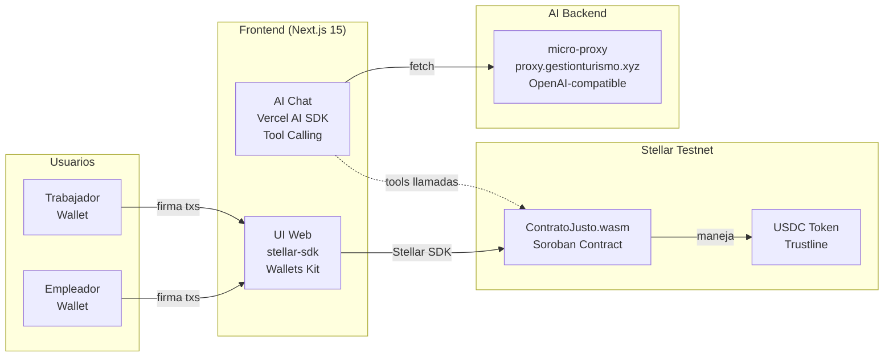
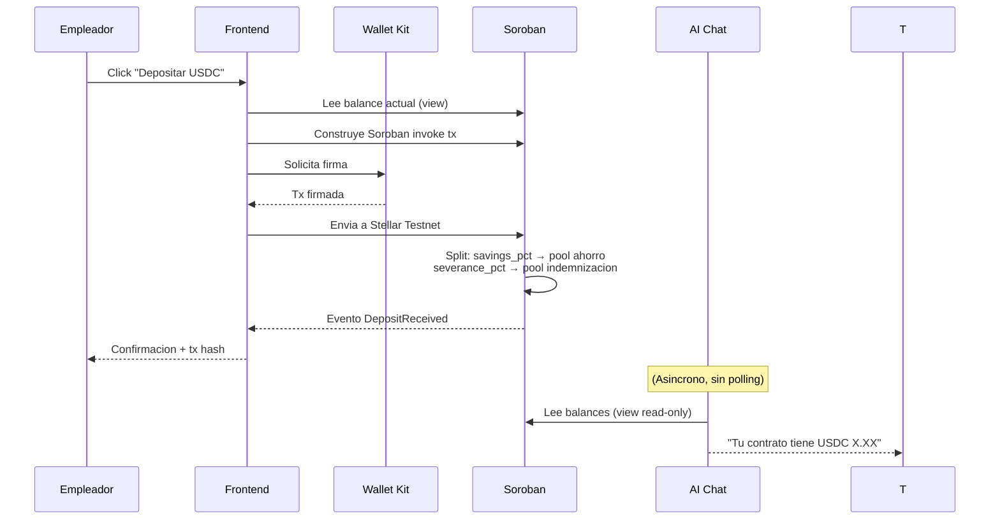

# 02 - Arquitectura: ContratoJusto

---

## 0. Project Decision Priority (Fuente de verdad)

**Velocidad de entrega > Demo funcional > Completitud**

Demo funcional en días. Cada decisión prioriza terminar flujos visibles sobre arquitectura perfecta. Complejidad sin valor demostrable = descartada.

---

## 1. Resumen Ejecutivo

**ContratoJusto** es un sistema de contratos laborales digitales para trabajadores informales sobre **Stellar**. Un smart contract Soroban custodia USDC y separa fondos en pools de ahorro e indemnización. Frontend Next.js con AI chat prepara transacciones en lenguaje natural. Sin backend tradicional: todo es on-chain + frontend + AI stateless.

Decisiones clave:
- USDC en Stellar Testnet (token estable, anti-inflación, standard)
- Soroban Rust (~150 líneas, simple, require_auth por función)
- Next.js 15 + Tailwind (SSR, routing, client components para Web3)
- AI Chat via Vercel AI SDK + micro-proxy (proxy.gestionturismo.xyz)
- Stellar Wallets Kit con soporte multi-wallet en navegador
- pnpm workspaces (un repo, un install, types compartidos)

---

## 2. Vista de Arquitectura General

**Canales sincronos**: Frontend → Soroban Contract via Stellar SDK (transacciones).
**Canales asincronos**: AI Chat → micro-proxy (consultas en lenguaje natural, sin persistencia).

---

## 3. Secuencia Critica: Deposito + Split en Pools

**Manejo de error**: Si la firma falla en la wallet, la tx no se envía. Si Soroban rechaza (validación), el evento no emite. Idempotencia via tx hash.

---

## 4. Responsabilidad de Componentes

| Componente | Responsabilidad | Datos/estado que gobierna | Dependencias |
|---|---|---|---|
| **ContratoJusto.wasm** | Custodia USDC, split pools (ahorro/indemnizacion), reglas reclamo/terminacion | Estado contractual, balances pools, depositos | Stellar Testnet, USDC token |
| **Frontend (Next.js 15)** | UI empleador/trabajador, wallet connect, AI chat UI, firma txs | Ninguno persistente (stateless, lee del contrato) | stellar-sdk, Stellar Wallets Kit, Vercel AI SDK |
| **AI Chat** | Consultas lenguaje natural, herramientas para leer/preparar txs | Ninguno (stateless, tools llaman a Soroban) | micro-proxy (LLM backend) |

**Regla de oro**: El smart contract Soroban es la única fuente de verdad. Frontend y AI son interfaces stateless.

---

## 5. Tecnologias y Decisiones Tecnicas

| Componente | Tecnologia | Motivo | Riesgo | Mitigacion |
|---|---|---|---|---|
| Smart Contract | Rust/Soroban, stellar-cli | Maximiza scoring integracion Stellar (25%) | Gabriel no sabe Rust | Claude Code asiste, contrato simple ~150 líneas, fallback Claimable Balances |
| Frontend | Next.js 15 + Tailwind CSS | Rápido, SSR, routing listo, client components | Complejidad SSR innecesaria | Usar client components para Web3 |
| Stellar SDK | @stellar/stellar-sdk v13.3.0 | Standard para Stellar, TypeScript nativo | Breaking changes | Seguir stellar-guide repo |
| Wallet | Stellar Wallets Kit (@creit.tech/stellar-wallets-kit) | Multi-wallet compatible con modal built-in. WalletConnect queda como integracion separada si el bundle lo permite. | Doc limitada | Patrones del workshop |
| AI Chat | Vercel AI SDK + tool calling | Framework standard para AI en Next.js | Tool calling complexity | Implementar incrementalmente |
| AI Backend | micro-proxy (proxy.gestionturismo.xyz) | Ya deployado, gratis, OpenAI-compatible | Si cae: fallback Google AI Studio | Health check al inicio |
| Token | USDC en Stellar testnet | Estable, anti-inflacion, standard | Requiere trustline setup | Friendbot + trustline automation en setup |
| Monorepo | pnpm workspaces | Un install, types compartidos | Config inicial | Estructura simple 2 packages (contract, web) |
| Red | Stellar Testnet | Gratis, Friendbot para fondear, horario mantenimiento ~diario | RPC puede ser lento | stellar-cli retry, healthcheck |

---

## 6. Seguridad, Observabilidad y Resiliencia

**Seguridad**:
- Soroban: `require_auth()` por función (solo empleador deposita, solo trabajador reclama)
- Sin backend = sin superficie API
- Wallet firma todo (no se almacenan keys en servidor)

**Observabilidad**:
- Eventos Soroban: `DepositReceived`, `ContractTerminated`, `SavingsClaimed`, `SeveranceClaimed`
- Stellar Horizon API para verificar txs on-chain
- Block explorer stellar.expert para auditoría manual

**Resiliencia**:
- Sin backend = sin SPOF. Contrato vive en blockchain.
- Si frontend cae, fondos seguros en Soroban.
- Si micro-proxy cae, AI no funciona pero web sigue con botones manuales.

---

## 7. Insumos para FL

| Flow | Actor | Componentes | Estado/Evento | Riesgo |
|---|---|---|---|---|
| **FL-01: Crear contrato** | Empleador | Frontend, Soroban | `ContractInitialized` | Parámetros inválidos |
| **FL-02: Depositar USDC** | Empleador | Frontend, Wallet Kit, Soroban | `DepositReceived` | Gas insuficiente, monto 0, trustline falta |
| **FL-03: Consultar via AI chat** | Trabajador | AI Chat, Soroban (view) | N/A (read-only) | micro-proxy timeout |
| **FL-04: Reclamar ahorro** | Trabajador | Frontend, Wallet Kit, Soroban | `SavingsClaimed` | Balance 0 |
| **FL-05: Terminar contrato** | Empleador | Frontend, Wallet Kit, Soroban | `ContractTerminated` + severance transfer | Re-entrancy (Soroban previene) |
| **FL-06: Reclamar indemnizacion** | Trabajador | Frontend, Wallet Kit, Soroban | `SeveranceClaimed` | Contrato no terminado aun |
| **FL-07: AI prepara transaccion** | Trabajador | AI Chat, Soroban, Wallet Kit | Tx prepared + signed | XDR construction error |

**Checklist**:
- [x] Cada flow tiene actor y dueño técnico claros
- [x] Cada flow tiene estados/eventos mínimos definidos
- [x] No quedan decisiones críticas abiertas
- [x] Contenido suficiente para iniciar `crear-flujo`

---

## 8. Supuestos y Limites

**Supuestos**:
1. Stellar Testnet RPC es estable para demo
2. Stellar Wallets Kit funciona con invocations Soroban sobre testnet
3. micro-proxy está operativo en proxy.gestionturismo.xyz
4. Claude Code puede asistir con Rust/Soroban ~150 líneas

**Limites**:
1. Sin persistencia off-chain (todo vive en blockchain)
2. Sin notificaciones push (solo AI chat pull asincrono)
3. Sin conversión USDC/ARS automatica (MVP en USDC)
4. Fallback a Claimable Balances nativo si Soroban falla
