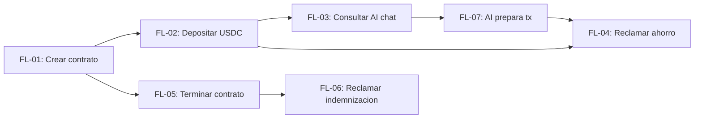

# 03 - Flujos Funcionales: ContratoJusto

> Inventario de flujos derivados de `.docs/wiki/02_arquitectura.md` §7

---

## Decision Priority aplicada a flujos

**Velocidad de entrega > Demo funcional > Completitud**

Los flujos se documentan con el detalle minimo necesario para que Claude Code implemente sin ambiguedad. No se documentan edge cases que no afecten el demo path.

---

## Inventario de flujos

| ID | Nombre | Actor principal | Componentes | Prioridad | RF |
|---|---|---|---|---|---|
| [FL-01](FL/FL-01-crear-contrato.md) | Crear contrato laboral | Empleador | Frontend, Wallet Kit, Soroban | P0 (demo) | RF-01-01 |
| [FL-02](FL/FL-02-depositar-usdc.md) | Depositar USDC | Empleador | Frontend, Wallet Kit, Soroban | P0 (demo) | RF-02-01 |
| [FL-03](FL/FL-03-consultar-ai-chat.md) | Consultar via AI chat | Trabajador | AI Chat, Soroban (view) | P0 (demo) | RF-04-01 |
| [FL-04](FL/FL-04-reclamar-ahorro.md) | Reclamar ahorro | Trabajador | Frontend, Wallet Kit, Soroban | P0 (demo) | RF-04-01 |
| [FL-05](FL/FL-05-terminar-contrato.md) | Terminar contrato | Empleador | Frontend, Wallet Kit, Soroban | P0 (demo) | RF-01-03 |
| [FL-06](FL/FL-06-reclamar-indemnizacion.md) | Reclamar indemnizacion | Trabajador | Frontend, Wallet Kit, Soroban | N/A (auto en FL-05) | N/A |
| [FL-07](FL/FL-07-ai-prepara-transaccion.md) | AI prepara transaccion | Trabajador | AI Chat, Soroban, Wallet Kit | P0 (demo wow) | RF-04-03 |

---

## Demo path (orden de ejecucion en el pitch)

```
FL-01 → FL-02 → FL-03 → FL-07/FL-04 → FL-05 (indemnizacion auto-release)
```

1. Empleador crea contrato (FL-01)
2. Empleador deposita 100 USDC (FL-02)
3. Trabajador pregunta "cuanto tengo?" (FL-03)
4. Trabajador dice "quiero reclamar mi ahorro" → AI prepara tx (FL-07) → Trabajador firma (FL-04)
5. Empleador termina contrato → indemnizacion se libera automaticamente (FL-05 + FL-06)

---

## Dependencias entre flujos


