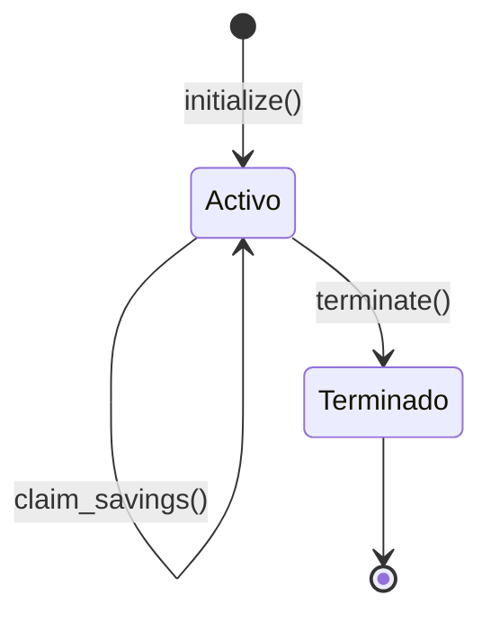

# 05 - Modelo de Datos: ContratoJusto

## Fuente de verdad
El smart contract Soroban es la UNICA fuente de verdad. No hay base de datos off-chain. Frontend y AI Chat son stateless.

## Entidad: ContratoLaboral (Soroban Instance Storage)

| Campo | Tipo Soroban | Tipo logico | Descripcion | Invariante |
|---|---|---|---|---|
| employer | Address | Direccion Stellar | Quien deposita y puede terminar | Inmutable post-initialize |
| worker | Address | Direccion Stellar | Quien reclama fondos | Inmutable post-initialize |
| token | Address | Direccion del contrato USDC | Token para depositos y reclamos | Inmutable post-initialize |
| savings_pct | u32 | Porcentaje (0-100) | % del deposito que va a ahorro | savings_pct + severance_pct == 100, inmutable |
| severance_pct | u32 | Porcentaje (0-100) | % del deposito que va a indemnizacion | savings_pct + severance_pct == 100, inmutable |
| savings_balance | i128 | Monto USDC (7 decimales) | Pool de ahorro acumulado | >= 0, se resetea a 0 en claim_savings |
| severance_balance | i128 | Monto USDC (7 decimales) | Pool de indemnizacion locked | >= 0, se libera SOLO en terminate() |
| total_deposited | i128 | Monto USDC (7 decimales) | Total historico depositado | Monotonicamente creciente |
| deposit_count | u32 | Contador | Cantidad de depositos realizados | Monotonicamente creciente |
| is_terminated | bool | Flag | Contrato terminado o activo | false -> true (irreversible) |

## Invariantes de negocio

1. savings_pct + severance_pct == 100 (validado en initialize)
2. Solo employer puede depositar (require_auth en deposit)
3. Solo worker puede reclamar savings (require_auth en claim_savings)
4. Solo employer puede terminar (require_auth en terminate)
5. deposit() solo funciona si is_terminated == false
6. terminate() es irreversible (false -> true, nunca true -> false)
7. terminate() auto-libera severance al worker
8. savings_balance + severance_balance <= total de USDC en el contrato
9. USDC usa 7 decimales (Stellar standard): 1 USDC = 10_000_000 units

## Diagrama de estados

## Proyecciones (read-only views)
- get_balance() -> (savings, severance, total, count)
- get_info() -> ContractInfo struct completo

## Notas
- No hay entidad "deposito individual" on-chain. Solo acumuladores.
- Para historial de depositos individuales: leer tx history via Horizon API (off-chain).
- No hay tabla de usuarios: employer y worker son addresses Stellar.
