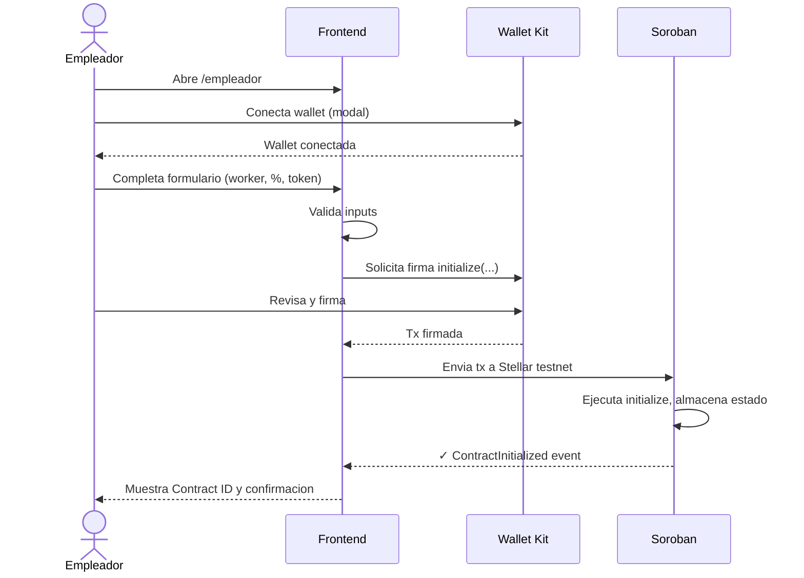

# FL-01: Crear contrato laboral

## Metadata
- **Actor principal**: Empleador
- **Componentes**: Frontend (Next.js), Wallet (Kit), Soroban Contract
- **Evento de exito**: ContractInitialized
- **Precondiciones**: Empleador tiene wallet conectada, tiene XLM para gas, conoce address del trabajador

## Pasos

| # | Actor | Accion | Componente | Resultado |
|---|---|---|---|---|
| 1 | Empleador | Abre pagina de empleador | Frontend | Se carga formulario de creacion |
| 2 | Empleador | Conecta wallet | Frontend + Wallet Kit | Wallet conectada, address visible |
| 3 | Empleador | Completa formulario | Frontend | Valida: worker address, savings_pct (default 70), severance_pct (default 30), token USDC |
| 4 | Frontend | Construye transaccion Soroban | Frontend | Invoke preparado: initialize(employer, worker, token, savings_pct, severance_pct) |
| 5 | Wallet | Muestra detalles de tx | Wallet Kit | Usuario revisa parametros y fee estimado |
| 6 | Empleador | Firma transaccion | Wallet Kit | Tx firmada con private key del empleador |
| 7 | Frontend | Envia tx a Stellar testnet | Soroban | Tx en mempool, esperando confirmacion |
| 8 | Soroban | Ejecuta initialize | Soroban Contract | Estado almacenado: employer, worker, token, porcentajes, balances = 0 |
| 9 | Frontend | Muestra confirmacion | Frontend | Exito: Contract ID y resumen de condiciones |

## Diagrama de secuencia

## Errores

| Error | Causa | Manejo |
|---|---|---|
| Percentages != 100 | savings_pct + severance_pct ≠ 100 | Frontend rechaza, mensaje: "Los porcentajes deben sumar 100" |
| Wallet rechaza firma | Usuario cancela en modal de firma | Limpiar form, mensaje: "Transaccion cancelada" |
| Gas insuficiente | Saldo XLM < fee estimado | Frontend valida antes, error: "XLM insuficiente para gas" |
| Worker address invalido | Formato no valido o no es direccion Stellar | Frontend valida formato, error: "Direccion de trabajador invalida" |
| Token address invalido | USDC token address no existe en testnet | Error de Soroban, no se crea contrato |

## Postcondiciones
- Contrato existe en Stellar testnet con estado inicial
- employer y worker asignados correctamente
- savings_balance y severance_balance = 0
- token USDC vinculado al contrato
- Empleador recibe Contract ID para proximas interacciones
