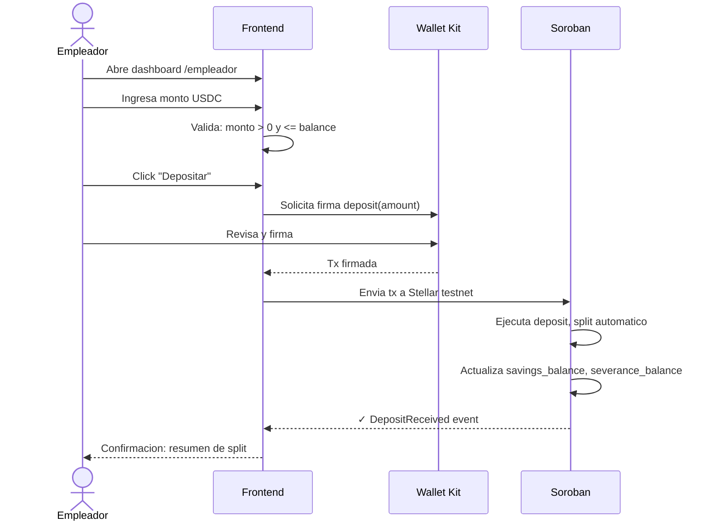

# FL-02: Depositar USDC

## Metadata
- **Actor principal**: Empleador
- **Componentes**: Frontend (Next.js), Wallet (Kit), Soroban Contract
- **Evento de exito**: DepositReceived
- **Precondiciones**: Contrato creado (FL-01), empleador tiene USDC y trustline, contrato activo (is_terminated == false)

## Pasos

| # | Actor | Accion | Componente | Resultado |
|---|---|---|---|---|
| 1 | Empleador | Abre pagina /empleador | Frontend | Se carga dashboard con form deposito |
| 2 | Empleador | Conecta wallet (si no esta) | Frontend + Wallet Kit | Wallet conectada |
| 3 | Empleador | Ingresa monto USDC | Frontend | Input validado: monto > 0, <= balance USDC |
| 4 | Empleador | Click "Depositar" | Frontend | Construye transaccion Soroban |
| 5 | Frontend | Build tx Soroban invoke | Frontend | Tx preparada: deposit(employer_address, amount) |
| 6 | Wallet | Muestra detalles de tx | Wallet Kit | Usuario revisa: USDC transfer + split automatico |
| 7 | Empleador | Firma transaccion | Wallet Kit | Tx firmada con private key |
| 8 | Frontend | Envia tx a Stellar testnet | Soroban | Tx en mempool |
| 9 | Soroban | Ejecuta deposit | Soroban Contract | Transfer USDC: savings_pct% a pool ahorro, severance_pct% a pool indemnizacion |
| 10 | Soroban | Actualiza estado | Soroban Contract | Incrementa savings_balance, severance_balance, total_deposited, deposit_count |
| 11 | Frontend | Muestra confirmacion | Frontend | "Depositaste X USDC. Ahorro: Y, Indemnizacion: Z" |

## Diagrama de secuencia

## Errores

| Error | Causa | Manejo |
|---|---|---|
| Monto = 0 | Usuario intenta depositar 0 | Frontend rechaza, error: "Monto debe ser mayor a 0" |
| Monto > balance | Empleador no tiene suficiente USDC | Frontend valida antes, error: "Saldo USDC insuficiente" |
| Trustline falta | Empleador no tiene trustline a USDC | Error de Soroban, no se transfiere |
| Contrato terminado | Empleador intenta depositar después de terminar | Mostrar mensaje: "El contrato ya fue terminado. No se pueden realizar más depósitos." |
| No es employer | Wallet conectada no es employer | Soroban rechaza, error: "No eres empleador de este contrato" |
| Gas insuficiente | Saldo XLM < fee estimado | Frontend valida, error: "XLM insuficiente para gas" |

## Postcondiciones
- USDC transferido de wallet del empleador a contrato
- savings_balance incrementado por (amount * savings_pct / 100)
- severance_balance incrementado por (amount * severance_pct / 100)
- total_deposited incrementado por amount
- deposit_count += 1
- Registro de transaccion disponible para auditar
