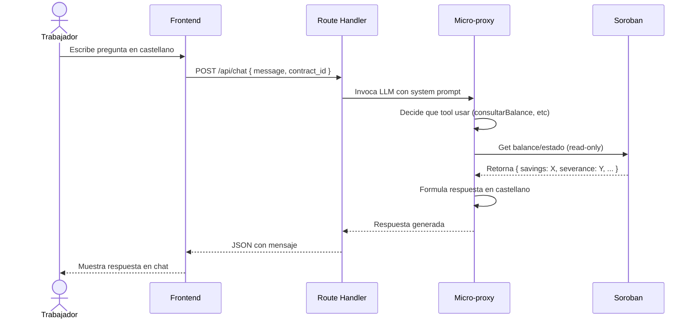

# FL-03: Consultar via AI chat

## Metadata
- **Actor principal**: Trabajador
- **Componentes**: AI Chat (Vercel AI SDK), Soroban Contract (view functions), Micro-proxy (LLM)
- **Evento de exito**: Respuesta generada y mostrada con integración Stellar Wallets Kit
- **Precondiciones**: Contrato creado (FL-01), al menos 1 deposito (FL-02), trabajador abre pagina /trabajador

## Pasos

| # | Actor | Accion | Componente | Resultado |
|---|---|---|---|---|
| 1 | Trabajador | Abre pagina /trabajador | Frontend | Chat UI visible con historial y input |
| 2 | Trabajador | Escribe pregunta en castellano | Frontend | Input: "¿Cuanto tengo?", "¿Mi patron deposito?", "¿Que es esto?" |
| 3 | Frontend | Envia mensaje a route handler | /api/chat | POST con: message, contract_id, worker_address |
| 4 | Route handler | Invoca micro-proxy con system prompt | Micro-proxy (LLM) | System: "Eres asistente sobre contratos laborales. Ayuda al trabajador" |
| 5 | LLM | Analiza mensaje y elige tool | Micro-proxy | Decide: consultarBalance o consultarEstado (o solo responde) |
| 6 | Tool ejecutor | Llama Soroban get functions | Stellar SDK | Read-only call: get_balance() o get_info() - sin firma |
| 7 | Soroban | Retorna datos | Soroban Contract | balance_savings, balance_severance, estado, total_deposited |
| 8 | LLM | Formula respuesta | Micro-proxy | Respuesta en castellano simple, amigable |
| 9 | Route handler | Retorna respuesta al frontend | Frontend | JSON: { message: "Tienes X USDC de ahorro..." } |
| 10 | Frontend | Muestra respuesta | UI Chat | Mensaje visible en historial |

## Diagrama de secuencia

## Errores

| Error | Causa | Manejo |
|---|---|---|
| Micro-proxy timeout | LLM o tool tarda > tiempo limite | Fallback: mostrar error amigable "No pude procesar tu pregunta. Intenta de nuevo" |
| Contrato no existe | Contract ID invalido o no existe | LLM detecta y responde: "No encuentro el contrato. Verifica el ID" |
| RPC Stellar caido | Stellar testnet RPC no responde | Try/catch, error: "Servicio no disponible. Intenta mas tarde" |
| Tool execution error | Error al leer estado del contrato | LLM responde: "Hubo un problema consultando tu contrato" |
| Invalid worker address | Worker address no es trabajador del contrato | Soroban rechaza read, LLM: "No estas asociado a este contrato" |

## Postcondiciones
- Trabajador recibe informacion actualizada de su contrato
- Datos leidos: no se modifica estado
- Historial de chat actualizado con pregunta y respuesta
- Ninguna transaccion en blockchain (read-only)
