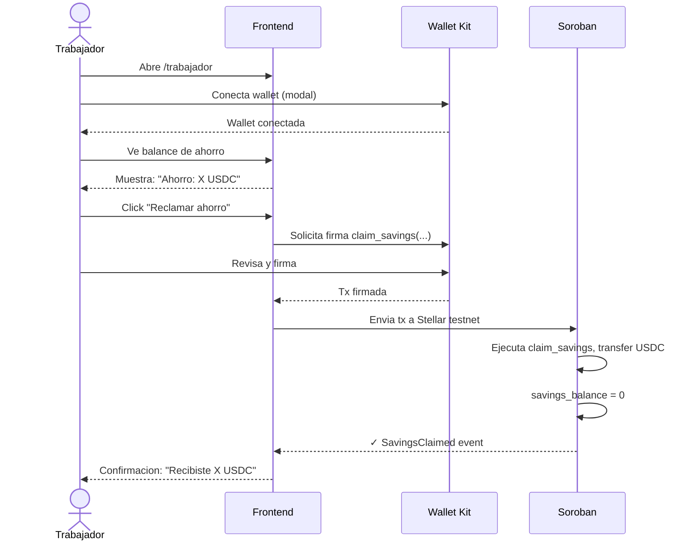

# FL-04: Reclamar ahorro

## Metadata
- **Actor principal**: Trabajador
- **Componentes**: Frontend (Next.js), Wallet (Kit), Soroban Contract
- **Evento de exito**: SavingsClaimed
- **Precondiciones**: Contrato creado (FL-01), savings_balance > 0, trabajador tiene wallet conectada

## Pasos

| # | Actor | Accion | Componente | Resultado |
|---|---|---|---|---|
| 1 | Trabajador | Abre pagina /trabajador | Frontend | Se carga dashboard con saldo de ahorro visible |
| 2 | Trabajador | Conecta wallet | Frontend + Wallet Kit | Wallet conectada, address visible |
| 3 | Trabajador | Ve balance de ahorro actual | Frontend | Muestra: "Ahorro: X USDC" |
| 4 | Trabajador | Click "Reclamar ahorro" | Frontend | Button activado, lanza tx builder |
| 5 | Frontend | Construye transaccion Soroban | Frontend | Tx preparada: claim_savings(worker_address) |
| 6 | Wallet | Muestra detalles de tx | Wallet Kit | Usuario revisa: transfer de savings_balance a su wallet |
| 7 | Trabajador | Firma transaccion | Wallet Kit | Tx firmada con private key del trabajador |
| 8 | Frontend | Envia tx a Stellar testnet | Soroban | Tx en mempool, esperando confirmacion |
| 9 | Soroban | Ejecuta claim_savings | Soroban Contract | Transfer savings_balance de contrato a worker address |
| 10 | Soroban | Actualiza estado | Soroban Contract | savings_balance = 0, increment claim_count |
| 11 | Frontend | Muestra confirmacion | Frontend | "Recibiste X USDC de ahorro en tu wallet" |

## Diagrama de secuencia

## Errores

| Error | Causa | Manejo |
|---|---|---|
| savings_balance == 0 | No hay ahorro para reclamar | Frontend deshabilita button, mensaje: "No tienes ahorro disponible" |
| No es worker | Wallet conectada no es worker del contrato | Soroban rechaza, error: "No eres el trabajador de este contrato" |
| Wallet rechaza firma | Usuario cancela en modal de firma | Limpiar, mensaje: "Transaccion cancelada" |
| Gas insuficiente | Saldo XLM del trabajador < fee estimado | Frontend valida, error: "XLM insuficiente para gas" |
| Trustline USDC no existe | Trabajador no tiene trustline a USDC token | Soroban no puede transferir, error: "Configura trustline para USDC primero" |
| Contrato terminado | Estado del contrato es terminated | Soroban permite reclamar siempre (postcondicion importante) |

## Postcondiciones
- savings_balance = 0 en contrato
- USDC transferido a wallet del trabajador (confirmed on chain)
- claim_count incrementado
- Trabajador puede checar su balance USDC en la wallet
- Registro de transaccion disponible para auditar
