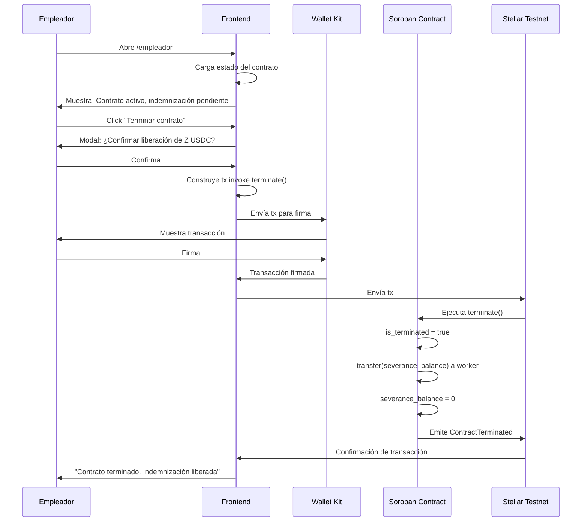

# FL-05: Terminar contrato

## Metadata
- **Actor principal**: Empleador
- **Componentes**: Frontend, Wallet (Kit), Soroban Contract
- **Evento de exito**: ContractTerminated (con transfer automático de indemnización)
- **Precondiciones**: Contrato creado (FL-01), contrato activo (is_terminated == false), empleador autenticado

## Pasos

| # | Actor | Accion | Componente | Resultado |
|---|---|---|---|---|
| 1 | Empleador | Abre /empleador | Frontend | Se carga vista de empleador |
| 2 | Empleador | Conecta wallet | Frontend | Wallet conectada, employer_address obtenida |
| 3 | Frontend | Muestra estado | Smart Contract | Estado actual: activo, indemnización pendiente |
| 4 | Empleador | Click "Terminar contrato" | Frontend | Se abre modal de confirmación |
| 5 | Frontend | Muestra confirmación | UI | "Esto liberará la indemnización (Z USDC) al trabajador. ¿Confirmar?" |
| 6 | Empleador | Confirma acción | Frontend | Procede a construir transacción |
| 7 | Frontend | Construye tx | Frontend | invoke `terminate(employer_address)` serializada |
| 8 | Frontend | Envía a Wallet Kit | Wallet Kit | Transacción lista para firma |
| 9 | Empleador | Firma con wallet | Wallet Kit | Transacción firmada |
| 10 | Frontend | Envía tx | Stellar Testnet | Transacción enviada a red |
| 11 | Soroban | Ejecuta terminate() | Smart Contract | is_terminated = true, transfer severance_balance a worker |
| 12 | Frontend | Muestra resultado | UI | "Contrato terminado. Indemnización de Z USDC liberada al trabajador" |

## Diagrama de secuencia

## Errores

| Error | Causa | Manejo |
|---|---|---|
| Contrato ya terminado | is_terminated == true | Frontend valida estado antes, muestra "Contrato ya ha sido terminado" |
| Usuario no es empleador | caller != employer_address | Soroban rechaza tx, Frontend muestra "Solo el empleador puede terminar" |
| Gas insuficiente | Saldo insuficiente en wallet | La wallet rechaza firma, usuario debe aumentar balance |
| Fallo en transfer de indemnización | Smart Contract error | Transacción revierte, indemnización queda disponible para FL-06 |
| Timeout de red | Stellar Testnet lento | Frontend muestra "Verificando...", permite reintentar |

## Postcondiciones
- is_terminated = true en Smart Contract
- severance_balance = 0 en Smart Contract
- USDC de indemnización transferido a wallet del trabajador
- Evento ContractTerminated emitido
- Contrato ya no puede recibir depósitos (FL-02) ni operaciones adicionales
- Trabajador puede consultar su balance incrementado en su wallet
