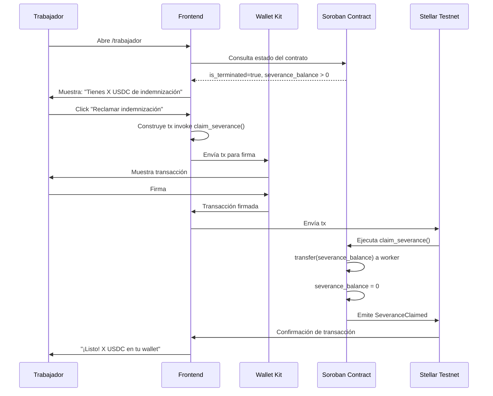

> **NOTA: Este flujo es HISTORICO. No implementar.** La indemnizacion se libera automaticamente dentro de `terminate()` (FL-05). No existe funcion `claim_severance()` en el contrato. Ver CLAUDE.md para detalles.

# FL-06: Reclamar indemnización

## Metadata
- **Actor principal**: Trabajador
- **Componentes**: Frontend, Wallet (Kit), Soroban Contract
- **Evento de exito**: SeveranceClaimed
- **Precondiciones**: Contrato terminado (is_terminated == true), indemnización pendiente (severance_balance > 0), trabajador autenticado

## Pasos

| # | Actor | Accion | Componente | Resultado |
|---|---|---|---|---|
| 1 | Trabajador | Abre /trabajador | Frontend | Se carga vista de trabajador |
| 2 | Trabajador | Conecta wallet | Frontend | Wallet conectada, worker_address obtenida |
| 3 | Frontend | Verifica estado | Smart Contract | Obtiene: is_terminated = true, severance_balance > 0 |
| 4 | Frontend | Muestra alerta | UI | "Tienes X USDC de indemnización pendiente" |
| 5 | Trabajador | Click "Reclamar indemnización" | Frontend | Se inicia flujo de reclamo |
| 6 | Frontend | Construye tx | Frontend | invoke `claim_severance(worker_address)` serializada |
| 7 | Frontend | Envía a Wallet Kit | Wallet Kit | Transacción lista para firma |
| 8 | Trabajador | Firma con wallet | Wallet Kit | Transacción firmada |
| 9 | Frontend | Envía tx | Stellar Testnet | Transacción enviada a red |
| 10 | Soroban | Ejecuta claim_severance() | Smart Contract | transfer severance_balance a worker, severance_balance = 0 |
| 11 | Frontend | Muestra resultado | UI | "¡Listo! X USDC de indemnización en tu wallet" |

## Diagrama de secuencia

## Errores

| Error | Causa | Manejo |
|---|---|---|
| Contrato no terminado | is_terminated == false | Frontend valida, muestra "El contrato aún está activo" |
| No hay indemnización pendiente | severance_balance == 0 | Frontend valida, muestra "Ya has reclamado tu indemnización" |
| Usuario no es trabajador | caller != worker_address | Soroban rechaza tx, Frontend muestra "Solo el trabajador puede reclamar" |
| Gas insuficiente | Saldo insuficiente en wallet | Wallet rechaza firma, usuario debe aumentar balance |
| Timeout de red | Stellar Testnet lento | Frontend muestra "Procesando...", permite reintentar |

## Postcondiciones
- severance_balance = 0 en Smart Contract
- USDC de indemnización transferido a wallet del trabajador
- Evento SeveranceClaimed emitido
- Trabajador puede verificar balance incrementado en su wallet
- No es posible reclamar nuevamente (severance_balance = 0)

## Notas de implementación
- Este flujo es un **mecanismo de seguridad/fallback**. En el flujo normal (FL-05), la indemnización se libera automáticamente cuando el empleador termina el contrato.
- FL-06 existe como contingencia si el auto-transfer en terminate() falla.
- Requiere implementar función `claim_severance()` en Soroban Contract (ya existe en lib.rs).
- En el MVP, puede no ser necesario si terminate() funciona correctamente. Documentar como "indemnización automática al terminar".
