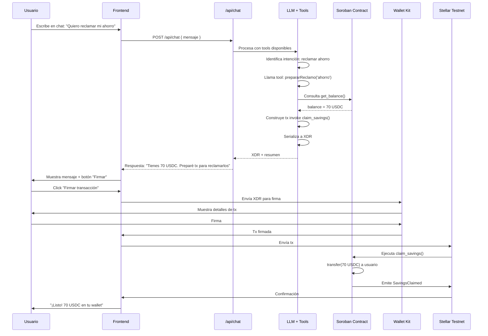

# FL-07: AI prepara transacción

## Metadata
- **Actor principal**: Trabajador (o Empleador)
- **Componentes**: AI Chat (Vercel AI SDK), Soroban Contract, Wallet (Kit), micro-proxy (LLM)
- **Evento de exito**: Depende de operación (SavingsClaimed, DepositReceived, etc.)
- **Precondiciones**: Contrato creado, usuario autenticado con wallet conectada, chat IA abierto

## Pasos

| # | Actor | Accion | Componente | Resultado |
|---|---|---|---|---|
| 1 | Usuario | Escribe en chat IA | Frontend | "Quiero reclamar mi ahorro" o "Quiero sacar mi plata" |
| 2 | Frontend | Envía mensaje | /api/chat | Mensaje enviado a route handler |
| 3 | Route Handler | Llama micro-proxy | LLM + Tools | Solicita procesamiento con herramientas disponibles |
| 4 | LLM | Analiza intención | AI | Identifica: reclamar ahorro, depositar, etc. |
| 5 | LLM | Llama herramienta | Tool: prepararReclamo() | Prepara transacción para tipo: 'ahorro' |
| 6 | Tool | Lee balance | Smart Contract | Consulta get_balance() para verificar fondos |
| 7 | Tool | Construye tx | Frontend | Builds invoke claim_savings(worker_address) |
| 8 | Tool | Serializa | Frontend | Convierte tx a XDR formato |
| 9 | Tool | Retorna resultado | LLM | XDR + resumen humano |
| 10 | LLM | Compone respuesta | AI | "Tienes 70 USDC de ahorro. Preparé la tx para reclamarlos. ¿Confirmas?" |
| 11 | Frontend | Muestra mensaje | UI | Mensaje con botón "Firmar transacción" |
| 12 | Usuario | Click "Firmar transacción" | Frontend | Inicia firma |
| 13 | Frontend | Envía XDR | Wallet Kit | Transacción para firma |
| 14 | Wallet | Muestra tx | UI | Usuario revisa detalles |
| 15 | Usuario | Firma con wallet | Wallet Kit | Transacción firmada |
| 16 | Wallet | Retorna firma | Frontend | Tx con firma |
| 17 | Frontend | Envía tx | Stellar Testnet | Transacción enviada a red |
| 18 | Soroban | Ejecuta operación | Smart Contract | claim_savings() o deposit() u otro |
| 19 | Frontend | Muestra resultado en chat | UI | "¡Listo! 70 USDC ya están en tu wallet" |

## Diagrama de secuencia

## Errores

| Error | Causa | Manejo |
|---|---|---|
| LLM no entiende intención | Lenguaje ambiguo o unclear | LLM responde: "No entendí bien. ¿Quieres reclamar ahorro, depositar fondos, o consultar balance?" |
| Balance insuficiente | savings_balance == 0 o menor a solicitado | AI informa: "No tienes ahorro disponible para reclamar" |
| Construcción XDR falla | Error en serialización | Frontend muestra: "No pude preparar la transacción. Intenta con botones manuales" |
| Wallet rechaza firma | Usuario cancela o error | Operación no se ejecuta, sin efectos secundarios, reintentar disponible |
| Micro-proxy timeout | LLM no responde en tiempo | Frontend muestra: "El asistente tardó. Intenta nuevamente o usa interfaz manual" |
| Usuario no autorizado | caller != expected address | Soroban rechaza, Frontend muestra: "No tienes permiso para esta operación" |
| Gas insuficiente | Saldo bajo en wallet | Wallet rechaza, usuario debe aumentar balance |

## Postcondiciones
- Transacción ejecutada según tipo de operación
- Estado on-chain actualizado (balances, etc.)
- Evento correspondiente emitido (SavingsClaimed, DepositReceived, etc.)
- Usuario ve confirmación en chat IA
- Historial de transacción disponible en balance/dashboard

## Herramientas disponibles del IA

| Tool | Input | Output | Descripción |
|---|---|---|---|
| prepararReclamo | tipo: 'ahorro' | XDR + resumen | Construye tx claim_savings(). Severance se libera auto en terminate(). |
| prepararDeposito | monto: number | XDR + resumen | Construye tx deposit(monto) para empleador |
| consultarBalance | - | { ahorro, indemnizacion, estado } | Lee balances sin construir tx |
| consultarEstado | - | { is_active, is_terminated, addresses, etc } | Lee info completa del contrato |

## Innovación diferenciadora
- **15% de diferenciación**: El IA no solo responde preguntas, sino que **prepara transacciones firmables** que el usuario ejecuta.
- Reduce fricción: Usuario no necesita buscar botones, el IA lo guía.
- Seguridad: Siempre muestra la tx en la wallet antes de ejecutar.
- Conversacional: Interfaz natural, menos clicks.
